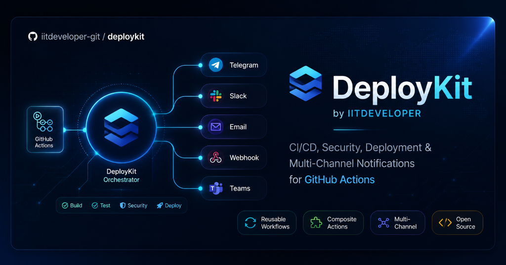

<p align="center">
  
</p>

<p align="center">
  <a href="https://github.com/iitdeveloper-git/deploykit/actions/workflows/ci.yml">
    
  </a>
  <a href="https://github.com/iitdeveloper-git/deploykit/releases">
    
  </a>
  <a href="https://core.telegram.org/bots/api">
    
  </a>
  <a href="https://api.slack.com/">
    
  </a>
  <a href="https://www.python.org/">
    
  </a>
  <a href="LICENSE">
    
  </a>
</p>

<p align="center">
  <b>DeployKit by IITDEVELOPER</b><br/>
  <i>Open-source CI/CD, security, release, and deployment automation for GitHub Actions.</i><br/>
  Drop-in multi-channel notifications (Telegram, Slack, Teams, Discord, Webhooks), standard CI pipelines, secure container builds, rollback-safe VPS deployments, and vulnerability scanning — zero duplication, zero vendor lock-in.
</p>

---

## 📑 Table of Contents

- [Overview & Architecture](#-overview--architecture)
- [Available Workflows & Actions](#-available-workflows--actions)
- [Quick Start](#-quick-start)
  - [1. Multi-Channel Notification Composite Action](#1-multi-channel-notification-composite-action)
  - [2. Multi-Channel Notification Reusable Workflow](#2-multi-channel-notification-reusable-workflow)
- [Catalog of Reusable Workflows](#-catalog-of-reusable-workflows)
  - [Node.js CI (`node-ci.yml`)](#nodejs-ci-node-ciyml)
  - [Python CI (`python-ci.yml`)](#python-ci-python-ciyml)
  - [Docker Build & Publish (`docker-build.yml`)](#docker-build--publish-docker-buildyml)
  - [Security Scan (`security-scan.yml`)](#security-scan-security-scanyml)
  - [SSH Docker Deployment with Rollback Guard (`deploy-ssh-docker.yml`)](#ssh-docker-deployment-with-rollback-guard-deploy-ssh-dockeryml)
  - [Release Automation (`release.yml`)](#release-automation-releaseyml)
- [🤖 AutoDeploy Agent Skill](#-autodeploy-agent-skill)
- [Secrets & Configuration Setup](#-secrets--configuration-setup)
- [Action Inputs Reference](#-action-inputs-reference)
- [Versioning & Release Strategy](#-versioning--release-strategy)
- [Security & Governance](#-security--governance)
- [Repository Structure](#-repository-structure)
- [Migration Guide from Shared Workflows](#-migration-guide-from-shared-workflows)
- [Contributing](#-contributing)
- [License](#-license)

---

## 🏗 Overview & Architecture

Maintaining duplicate GitHub Action workflow YAML files across multiple repositories creates maintenance overhead, security drift, and configuration fragmentation.

**DeployKit** solves this by providing:

1. **Centralized Standardization:** Write once, patch once, inherit everywhere.
2. **Hardened Security & Least Privilege:** Default minimal `permissions: contents: read`, zero secrets logging, input validation, and parameter sanitization.
3. **Pure Standard Library Runtime:** Composite actions rely on pure Python standard library scripts with zero third-party dependencies, eliminating runtime supply-chain risks.
4. **Multi-Channel Alert Routing:** Unified notification engine supporting Telegram, Slack, Microsoft Teams, Discord, and generic HTTP Webhooks.
5. **Rollback-Guarded VPS / Docker Deployments:** Parameter-validated Docker Compose updates with verifiable SSH host configuration, health check probes, and automated rollback upon health check failure.

```
┌────────────────────────────────────────────────────────┐
│                   Caller Repositories                  │
├───────────────────┬──────────────────┬─────────────────┤
│    Frontend Web   │   Backend APIs   │  Microservices  │
└─────────┬─────────┴────────┬─────────┴────────┬────────┘
          │                  │                  │
          ▼                  ▼                  ▼
┌────────────────────────────────────────────────────────┐
│             iitdeveloper-git/deploykit@v1              │
├────────────────────────────────────────────────────────┤
│ • actions/notify (Multi-Channel Composite Action)      │
│ • actions/telegram-notify (Telegram Composite Action)  │
│ • .github/workflows/notify.yml (Reusable Router)       │
│ • .github/workflows/telegram-notify.yml (Reusable)    │
│ • .github/workflows/node-ci.yml (Reusable)             │
│ • .github/workflows/python-ci.yml (Reusable)           │
│ • .github/workflows/docker-build.yml (Reusable)        │
│ • .github/workflows/deploy-ssh-docker.yml (Reusable)   │
│ • .github/workflows/security-scan.yml (Reusable)       │
│ • .github/workflows/release.yml (Reusable)             │
│ • skills/iitdeveloper-autodeploy (AI Agent Skill)      │
└────────────────────────────────────────────────────────┘
```

---

## 📦 Available Workflows & Actions

| Workflow / Action | Type | Description |
|---|---|---|
| [`actions/notify`](actions/notify/) | **Composite Action** | Dispatches deployment & CI status notifications to Telegram, Slack, Teams, Discord, or Webhook. |
| [`actions/telegram-notify`](actions/telegram-notify/) | **Composite Action** | Dispatches rich HTML / Plaintext Telegram deployment & CI status alerts. |
| [`.github/workflows/notify.yml`](.github/workflows/notify.yml) | **Reusable Workflow** | Standalone multi-channel notification job. |
| [`.github/workflows/telegram-notify.yml`](.github/workflows/telegram-notify.yml) | **Reusable Workflow** | Standalone caller job to trigger Telegram alerts. |
| [`.github/workflows/node-ci.yml`](.github/workflows/node-ci.yml) | **Reusable Workflow** | Matrix CI pipeline for Node.js (lint, test, build with npm/yarn/pnpm/bun). |
| [`.github/workflows/python-ci.yml`](.github/workflows/python-ci.yml) | **Reusable Workflow** | Python test suite and linter runner with pip caching and pyproject.toml support. |
| [`.github/workflows/docker-build.yml`](.github/workflows/docker-build.yml) | **Reusable Workflow** | Multi-arch Docker container build, tag, and publish with Buildx. |
| [`.github/workflows/deploy-ssh-docker.yml`](.github/workflows/deploy-ssh-docker.yml) | **Reusable Workflow** | Secure VPS / Docker Compose deployment with health check & rollback safety. |
| [`.github/workflows/security-scan.yml`](.github/workflows/security-scan.yml) | **Reusable Workflow** | Filesystem and container vulnerability scanning with Trivy. |
| [`.github/workflows/release.yml`](.github/workflows/release.yml) | **Reusable Workflow** | Automated GitHub Release publishing and asset attachment. |
| [`skills/iitdeveloper-autodeploy`](skills/iitdeveloper-autodeploy/) | **Agent Skill** | Antigravity AI skill to configure any repository with `deploykit@v1`. |

---

## 🚀 Quick Start

### 1. Multi-Channel Notification Composite Action

Add this step to the end of any job in your repository:

```yaml
      - name: 📢 Send Deployment Notification
        if: always()
        uses: iitdeveloper-git/deploykit/actions/notify@v1
        with:
          channel: 'slack' # telegram, slack, teams, discord, webhook (or auto)
          webhook_url: ${{ secrets.SLACK_WEBHOOK_URL }}
          bot_token: ${{ secrets.TELEGRAM_BOT_TOKEN }}
          chat_id: ${{ secrets.TELEGRAM_CHAT_ID }}
          app_name: 'My Service'
          environment: 'Production'
          status: ${{ job.status }}
          release_tag: ${{ steps.version.outputs.tag }}
          app_url: 'https://app.example.com'
          custom_message: '🚀 Deployed hotfix for checkout flow.'
```

> **Note:** Automatically adapts theme, emojis, and payload formats for each chat platform.

---

### 2. Multi-Channel Notification Reusable Workflow

Call it as a standalone job after deployment steps complete:

```yaml
  notify:
    name: 📢 Multi-Channel Notification
    needs: [deploy]
    if: always()
    uses: iitdeveloper-git/deploykit/.github/workflows/notify.yml@v1
    with:
      channel: 'teams' # telegram, slack, teams, discord, webhook
      app_name: 'Payment API'
      environment: 'Production'
      status: ${{ needs.deploy.result }}
      release_tag: ${{ needs.deploy.outputs.tag }}
      app_url: 'https://api.example.com'
    secrets:
      WEBHOOK_URL: ${{ secrets.TEAMS_WEBHOOK_URL }}
      TELEGRAM_BOT_TOKEN: ${{ secrets.TELEGRAM_BOT_TOKEN }}
      TELEGRAM_CHAT_ID: ${{ secrets.TELEGRAM_CHAT_ID }}
```

---

## 📚 Catalog of Reusable Workflows

### Node.js CI (`node-ci.yml`)

```yaml
jobs:
  test:
    uses: iitdeveloper-git/deploykit/.github/workflows/node-ci.yml@v1
    with:
      node-version: '20'
      package-manager: 'npm' # npm, yarn, pnpm, bun
      run-lint: true
      run-test: true
      run-build: true
```

### Python CI (`python-ci.yml`)

```yaml
jobs:
  test:
    uses: iitdeveloper-git/deploykit/.github/workflows/python-ci.yml@v1
    with:
      python-version: '3.11'
      requirements-file: 'requirements.txt'
      run-lint: true
      run-test: true
      test-command: 'pytest --cov=src'
```

### Docker Build & Publish (`docker-build.yml`)

```yaml
jobs:
  build-and-push:
    uses: iitdeveloper-git/deploykit/.github/workflows/docker-build.yml@v1
    with:
      image-name: ghcr.io/${{ github.repository }}
      push: true
      tags: latest
      platforms: linux/amd64,linux/arm64
    secrets:
      REGISTRY_USERNAME: ${{ github.actor }}
      REGISTRY_PASSWORD: ${{ secrets.GITHUB_TOKEN }}
```

### Security Scan (`security-scan.yml`)

```yaml
jobs:
  security-audit:
    uses: iitdeveloper-git/deploykit/.github/workflows/security-scan.yml@v1
    with:
      scan-type: 'fs'
      severity: 'CRITICAL,HIGH'
      exit-code: '1' # Fails CI if CRITICAL/HIGH vulnerabilities exist
```

### SSH Docker Deployment with Rollback Guard (`deploy-ssh-docker.yml`)

```yaml
jobs:
  deploy:
    uses: iitdeveloper-git/deploykit/.github/workflows/deploy-ssh-docker.yml@v1
    with:
      environment: 'Production'
      environment-url: 'https://app.example.com'
      compose-directory: '/opt/app'
      compose-file: 'docker-compose.yml'
      image-tag: ${{ github.sha }}
      health-check-url: 'https://app.example.com/health'
      rollback-on-failure: true
    secrets:
      DEPLOY_HOST: ${{ secrets.DEPLOY_HOST }}
      DEPLOY_USER: ${{ secrets.DEPLOY_USER }}
      DEPLOY_SSH_KEY: ${{ secrets.DEPLOY_SSH_KEY }}
      DEPLOY_SSH_KNOWN_HOSTS: ${{ secrets.DEPLOY_SSH_KNOWN_HOSTS }}
```

### Release Automation (`release.yml`)

```yaml
jobs:
  release:
    uses: iitdeveloper-git/deploykit/.github/workflows/release.yml@v1
    with:
      generate_release_notes: true
      files: 'dist/*.tar.gz'
```

Check out [`examples/`](examples/) for full end-to-end caller workflow files.

---

## 🤖 AutoDeploy Agent Skill

DeployKit includes the **`iitdeveloper-autodeploy`** AI Agent skill. Any AI coding assistant (like Antigravity) can use this skill to automatically inspect any repository and configure production CI/CD pipelines powered by `iitdeveloper-git/deploykit@v1`.

### How to Use with Your Agent:

1. Copy the skill into your project's `.agents/skills/` directory:
   ```bash
   cp -r skills/iitdeveloper-autodeploy .agents/skills/
   ```
2. Prompt your coding agent:
   > *"Use the `iitdeveloper-autodeploy` skill to set up CI/CD, deployment, and multi-channel notifications for this project."*
3. The agent will automatically detect the language/framework, assemble the least-privilege workflow files, configure alert channels, and output the required GitHub secrets list.

---

## 🔑 Secrets & Configuration Setup

Configure notification and deployment secrets at the **Organization Level** or **Repository Level**:

1. Go to **Settings** → **Secrets and variables** → **Actions**.
2. Add the relevant secrets:
   - `TELEGRAM_BOT_TOKEN` & `TELEGRAM_CHAT_ID`: For Telegram alerts.
   - `WEBHOOK_URL`: For Slack, Teams, Discord, or generic Webhooks.
   - `DEPLOY_HOST`, `DEPLOY_USER`, `DEPLOY_SSH_KEY`, `DEPLOY_SSH_KNOWN_HOSTS`: For remote SSH deployments.

---

## 📋 Action Inputs Reference

### `actions/notify` & `notify.yml`

| Input | Required | Default | Description |
|---|:---:|---|---|
| `channel` | ➖ | `""` | Target channel: `telegram`, `slack`, `teams`, `discord`, `webhook` (auto-detected if omitted). |
| `webhook_url` / `WEBHOOK_URL` | ➖ | `""` | Webhook URL for Slack, Teams, Discord, or Webhooks. |
| `bot_token` / `TELEGRAM_BOT_TOKEN` | ➖ | `""` | Telegram Bot HTTP API Token. |
| `chat_id` / `TELEGRAM_CHAT_ID` | ➖ | `""` | Target Telegram Group/Channel Chat ID. |
| `message_thread_id` | ➖ | `""` | Telegram Topic / Thread ID (for Supergroups with forum topics enabled). |
| `app_name` | ➖ | `repo name` | Application or microservice name. |
| `environment` | ➖ | `'Production'` | Environment (e.g. `Production`, `Staging`, `CI / Tests`). |
| `status` | ➖ | `'success'` | Job status (`success`, `failure`, `cancelled`, `timed_out`). |
| `release_tag` | ➖ | `""` | Release tag or SemVer string (e.g. `v1.2.0`). |
| `app_url` | ➖ | `""` | Live application or dashboard URL. |
| `custom_message` | ➖ | `""` | Optional markdown/custom release notes. |

---

## 🏷 Versioning & Release Strategy

DeployKit adheres strictly to [Semantic Versioning (SemVer)](https://semver.org/).

### Recommended Pinning

- **Pinned Major Release (Recommended):**
  ```yaml
  uses: iitdeveloper-git/deploykit/.github/workflows/node-ci.yml@v1
  ```
  *Receives backwards-compatible feature updates and security patches automatically.*

- **Pinned Exact Patch (Highest Determinism):**
  ```yaml
  uses: iitdeveloper-git/deploykit/.github/workflows/node-ci.yml@v1.0.1
  ```

- **Pinned Full Commit SHA (Maximum Security & Zero-Trust):**
  ```yaml
  uses: iitdeveloper-git/deploykit/.github/workflows/node-ci.yml@<FULL_COMMIT_SHA>
  ```

---

## 🔒 Security & Governance

- **Least Privilege:** Reusable workflows define explicit minimum permissions (`contents: read`).
- **No Token Logging:** Tokens are strictly supplied via environment variables and never printed or exposed in logs.
- **Dependency Minimization:** Scripts use the Python Standard Library to avoid third-party supply chain vulnerabilities.
- **Input Validation:** Strict regex checking prevents remote shell parameter injection.
- For vulnerability reports and security policy, see [SECURITY.md](SECURITY.md).

---

## 📁 Repository Structure

```
deploykit/
├── .agents/
│   └── skills/
│       └── iitdeveloper-autodeploy/    # Workspace AI Agent AutoDeploy skill
│           ├── SKILL.md
│           └── references/
│               ├── examples.md
│               └── secrets.md
├── .github/
│   ├── assets/
│   │   └── banner.png                  # Official project banner asset
│   ├── dependabot.yml                  # Weekly automated dependency maintenance
│   ├── ISSUE_TEMPLATE/                 # Structured bug report & feature request forms
│   │   ├── bug_report.yml
│   │   ├── feature_request.yml
│   │   └── config.yml
│   ├── pull_request_template.md        # Pull request template
│   └── workflows/
│       ├── ci.yml                      # Repository CI (actionlint, linting, tests)
│       ├── deploy-ssh-docker.yml       # Reusable SSH / Docker Compose deploy workflow with rollback
│       ├── docker-build.yml            # Reusable Docker build & publish workflow
│       ├── node-ci.yml                 # Reusable Node.js CI workflow
│       ├── notify.yml                  # Reusable Multi-channel notification workflow
│       ├── python-ci.yml               # Reusable Python CI workflow
│       ├── release.yml                 # Reusable GitHub Release publishing workflow
│       ├── security-scan.yml           # Reusable Security scan workflow
│       └── telegram-notify.yml         # Reusable Telegram notification workflow
├── actions/
│   ├── notify/
│   │   ├── action.yml                  # Multi-channel notification composite action manifest
│   │   └── send.py                     # Multi-channel Python dispatcher script
│   └── telegram-notify/
│       ├── action.yml                  # Telegram notification composite action manifest
│       └── send.py                     # Zero-dependency Python dispatcher script
├── examples/                           # Ready-to-use caller workflow templates
│   ├── docker-build-push.yml
│   ├── full-deploy-pipeline.yml
│   ├── nodejs-ci.yml
│   ├── python-ci.yml
│   ├── security-scan.yml
│   └── telegram-notification.yml
├── skills/
│   └── iitdeveloper-autodeploy/        # Exportable Agent skill bundle
│       ├── SKILL.md
│       └── references/
│           ├── examples.md
│           └── secrets.md
├── tests/
│   ├── __init__.py
│   ├── test_notify.py                  # Unit test suite for Multi-channel notifications (100% branch coverage)
│   ├── test_telegram_send.py           # Unit test suite for Telegram notifications (100% branch coverage)
│   └── test_workflows_schema.py        # Schema & least-privilege security tests
├── CHANGELOG.md                        # Semantic release changelog
├── CODE_OF_CONDUCT.md                  # Contributor Covenant v2.1
├── CONTRIBUTING.md                     # Contribution & local testing guide
├── LICENSE                             # MIT License
├── README.md                           # Documentation & quick start guide
└── SECURITY.md                         # Security and vulnerability reporting policy
```

---

## 🔄 Migration Guide from Shared Workflows

DeployKit is the evolution of `iitdeveloper-git/shared-workflows`. To migrate existing application repositories to DeployKit, simply update workflow and action references:

| Old Reference | New DeployKit Reference |
|---|---|
| `iitdeveloper-git/shared-workflows/actions/telegram-notify@v1` | `iitdeveloper-git/deploykit/actions/telegram-notify@v1` |
| `iitdeveloper-git/shared-workflows/.github/workflows/telegram-notify.yml@v1` | `iitdeveloper-git/deploykit/.github/workflows/telegram-notify.yml@v1` |
| `iitdeveloper-git/shared-workflows/.github/workflows/node-ci.yml@v1` | `iitdeveloper-git/deploykit/.github/workflows/node-ci.yml@v1` |
| `iitdeveloper-git/shared-workflows/.github/workflows/python-ci.yml@v1` | `iitdeveloper-git/deploykit/.github/workflows/python-ci.yml@v1` |
| `iitdeveloper-git/shared-workflows/.github/workflows/docker-build.yml@v1` | `iitdeveloper-git/deploykit/.github/workflows/docker-build.yml@v1` |
| `iitdeveloper-git/shared-workflows/.github/workflows/security-scan.yml@v1` | `iitdeveloper-git/deploykit/.github/workflows/security-scan.yml@v1` |

> **Compatibility Guarantee:** All inputs, secrets, and outputs in DeployKit `@v1` are 100% compatible with `shared-workflows@v1`. Only the repository path needs to be updated.

---

## 🤝 Contributing

We welcome community contributions! Please read our [CONTRIBUTING.md](CONTRIBUTING.md) and [CODE_OF_CONDUCT.md](CODE_OF_CONDUCT.md) before opening pull requests.

---

## 📄 License

This project is licensed under the [MIT License](LICENSE) &copy; 2026 iitdeveloper-git and contributors.
