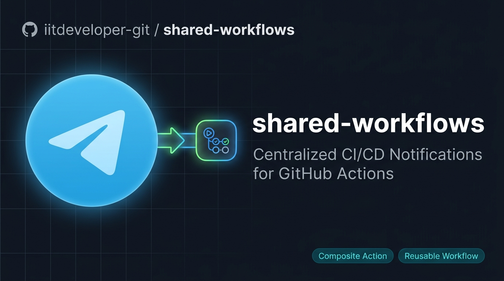

<p align="center">
  
</p>

<p align="center">
  <a href="https://github.com/iitdeveloper-git/shared-workflows/actions">
    
  </a>
  <a href="https://core.telegram.org/bots/api">
    
  </a>
  
  
</p>

<p align="center">
  <b>Centralized, reusable GitHub Actions workflows & composite actions for all <code>iitdeveloper-git</code> projects.</b><br/>
  Drop-in Telegram deployment notifications — rich HTML messages, zero duplication.
</p>

---

## ✨ What You Get

When a deployment runs, your Telegram group gets an instant message like this:

```
🚀 Growixa — Deployment Succeeded

🏷 Environment:  🟢 Production
📦 Release:      v2.4.1
👤 Triggered By: ravi
🔗 Commit:       a3f8c91
🌐 Live URL:     https://growixa.iitdeveloper.com

📝 Hotfix: resolved checkout session timeout issue

📊 View GitHub Actions Run →
```

> Supports `success` 🟢 · `failure` 🔴 · `cancelled` ⚪️ — automatically.

---

## 🚀 Quick Start

### Method A — Composite Action *(Recommended for existing jobs)*

Add a single step to the end of your deployment job:

```yaml
      - name: 📢 Send Telegram Notification
        if: always()
        uses: iitdeveloper-git/shared-workflows/actions/telegram-notify@main
        with:
          bot_token:    ${{ secrets.TELEGRAM_BOT_TOKEN }}
          chat_id:      ${{ secrets.TELEGRAM_CHAT_ID }}
          app_name:     'Growixa'
          environment:  'Production'
          status:       ${{ job.status }}
          release_tag:  ${{ steps.vars.outputs.tag }}
          app_url:      'https://growixa.iitdeveloper.com'
```

---

### Method B — Reusable Workflow *(workflow_call)*

Call it as a standalone job after your deploy completes:

```yaml
  notify:
    name: 📢 Telegram Notification
    needs: [deploy]
    if: always()
    uses: iitdeveloper-git/shared-workflows/.github/workflows/telegram-notify.yml@main
    with:
      app_name:      'Growixa'
      environment:   'Production'
      status:        ${{ needs.deploy.result }}
      release_tag:   ${{ needs.deploy.outputs.tag }}
      app_url:       'https://growixa.iitdeveloper.com'
    secrets:
      TELEGRAM_BOT_TOKEN: ${{ secrets.TELEGRAM_BOT_TOKEN }}
      TELEGRAM_CHAT_ID:   ${{ secrets.TELEGRAM_CHAT_ID }}
```

---

## 🔑 One-Time Secrets Setup

Configure secrets **once** at the Organization level — all repos inherit them automatically.

| Step | Where to go |
|------|-------------|
| 1️⃣ | **Organization Settings** → **Secrets and variables** → **Actions** |
| 2️⃣ | Add `TELEGRAM_BOT_TOKEN` — get from [@BotFather](https://t.me/BotFather) |
| 3️⃣ | Add `TELEGRAM_CHAT_ID` — your group/channel ID (e.g. `-1001234567890`) |
| 4️⃣ | Set **Repository access** → **All repositories** ✅ |

---

## 📋 Inputs Reference

| Input | Required | Default | Description |
|---|:---:|---|---|
| `bot_token` | ✅ | — | Telegram Bot HTTP API Token |
| `chat_id` | ✅ | — | Target Group/Channel Chat ID |
| `app_name` | ✅ | — | Application name (e.g. `Growixa`) |
| `environment` | ✅ | — | `Production`, `UAT`, `Staging` |
| `status` | ✅ | — | `success` · `failure` · `cancelled` |
| `release_tag` | ➖ | `""` | Version tag (e.g. `v1.0.0`) |
| `app_url` | ➖ | `""` | Live URL of the deployed app |
| `custom_message` | ➖ | `""` | Extra release notes or custom text |
| `message_thread_id` | ➖ | `""` | Telegram topic ID (for forum groups) |

---

## 📁 Repository Structure

```
shared-workflows/
├── .github/
│   ├── assets/
│   │   └── banner.jpg
│   └── workflows/
│       └── telegram-notify.yml   # Reusable workflow (workflow_call)
└── actions/
    └── telegram-notify/
        └── action.yml            # Composite action
```

---

<p align="center">
  Built with ❤️ by <a href="https://github.com/iitdeveloper-git"><b>iitdeveloper-git</b></a>
</p>
